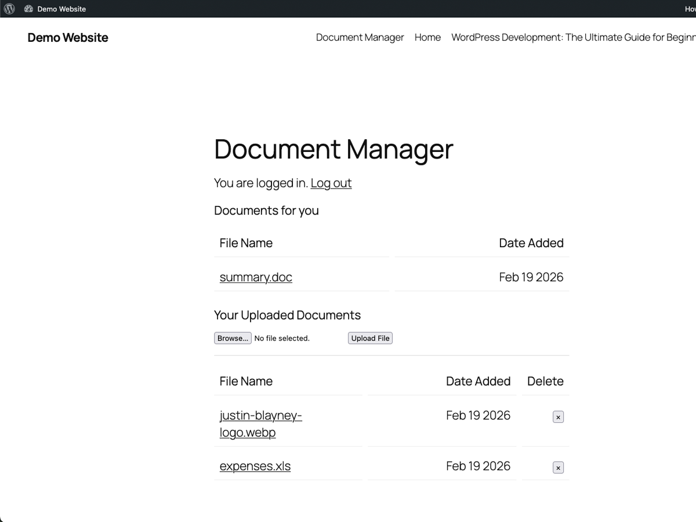
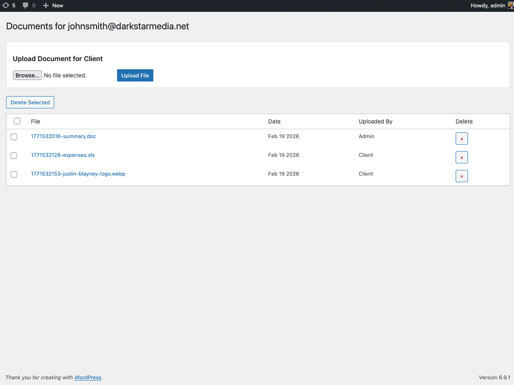
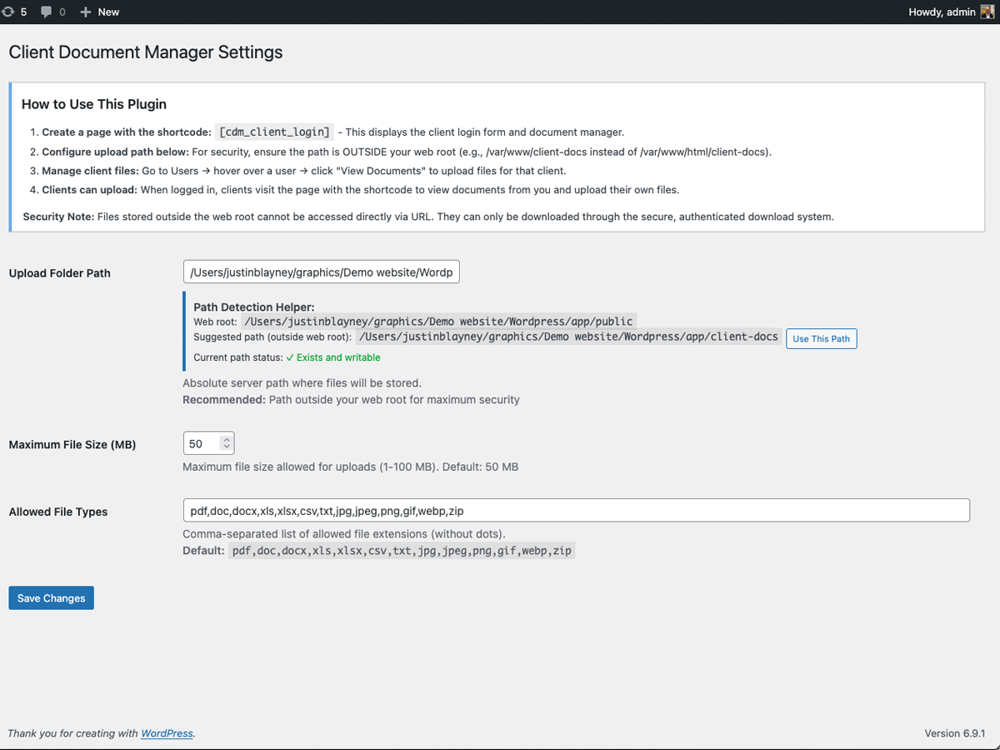
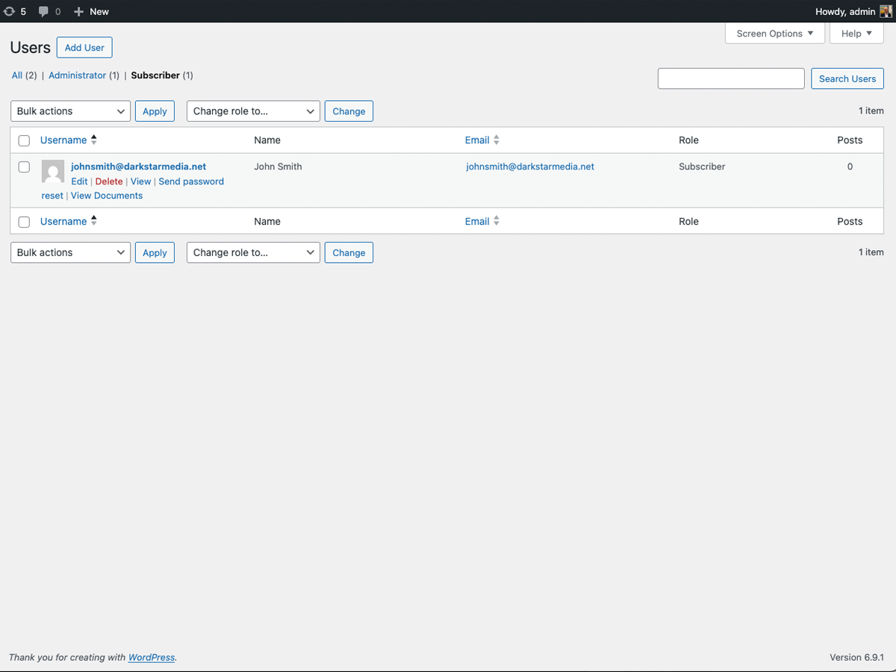

# Document Manager

A WordPress plugin for securely exchanging documents between administrators and clients. Files are served through an authenticated download handler — clients can only access their own files. You choose where files are stored, and **we strongly recommend a directory outside the web root** so they cannot be accessed directly via URL under any circumstances.

---

## Why Outside the Web Root?

Most WordPress file plugins store uploads inside `wp-content/uploads/`. Any file in that directory has a direct URL — if someone guesses or obtains the link, they can download it without logging in.

Document Manager lets you store files in **any directory you choose**. For maximum security we recommend a path outside your web root (e.g. `/var/www/client-docs` instead of `/var/www/html/wp-content/uploads`). Files stored there have no direct URL — they can only be served through the plugin's authenticated download handler, which verifies the user is logged in and owns the file before delivering it.

If you prefer, files can also be stored inside the web root (e.g. within `wp-content`). The authenticated handler still protects downloads, but a direct URL to the file would bypass that protection — so outside the web root is always the safer choice.

---

## Features

- **Configurable file storage path** — store files anywhere; outside the web root recommended for maximum security
- **Two-way file sharing** — admins upload files for clients, clients upload files back
- **Strict user isolation** — each client can only access their own files
- **Separate file sections** — clients see "Documents for you" (from admin) and "Your Uploaded Documents" separately
- **Simple shortcode** — add `[cdm_client_login]` to any page
- **File type and MIME validation** — configurable allowed types
- **ZIP bomb protection** — uncompressed content size limit enforced
- **Upload rate limiting** — 20 uploads per user per hour
- **CSRF protection** — nonce verification on all forms and downloads
- **Protective `.htaccess`** — automatically written to upload directory on activation
- **Bulk delete** — admins can delete multiple client files at once
- **Translation ready** — full i18n support with Polylang integration
- **Responsive design** — works on desktop, tablet, and mobile

---

## Screenshots

### Client Portal — front-end view


### Admin — View Documents for a client


### Settings Page


### Users List — View Documents link


---

## Requirements

- WordPress 5.0 or higher
- PHP 7.4 or higher
- A server directory outside the web root that PHP can write to

---

## Installation

1. Download the plugin zip from [Releases](https://github.com/justinblayney/Document-Manager/releases)
2. In WordPress admin go to **Plugins → Add New → Upload Plugin**
3. Upload the zip and click **Install Now**, then **Activate**
4. Go to **Settings → Document Manager**
5. Set the upload folder path to a directory **outside your web root**
   - e.g. `/var/www/client-docs` (not `/var/www/html/...`)
   - The path detection helper on the settings page will suggest one
6. Create a page and add the shortcode `[cdm_client_login]`
7. Publish the page and share the URL with your clients

---

## Usage

### Shortcode

Place on any WordPress page:

```
[cdm_client_login]
```

- Shows a login form to unauthenticated visitors
- Shows the document portal to logged-in users

### Uploading files for a client (admin)

1. Go to **Users** in WP admin
2. Hover over the client's username
3. Click **View Documents**
4. Use the upload form at the top of the page

### Client experience

Once logged in, clients visit the page with the shortcode and see:
- **Documents for you** — files uploaded by the admin (read-only, download only)
- **Your Uploaded Documents** — files they uploaded themselves, with delete option

---

## Security

| Layer | Detail |
|---|---|
| Configurable storage path | Store files outside the web root (recommended) to eliminate direct URL access entirely |
| Authenticated downloads | Every download verifies the user is logged in and owns the file |
| Path traversal protection | Directory separator enforcement on all file path checks |
| CSRF protection | Nonce verification on all forms and admin downloads |
| MIME validation | File extension + MIME type both checked on upload |
| ZIP bomb protection | Uncompressed content capped at 512 MB |
| Rate limiting | 20 uploads per user per hour via WordPress transients |
| `.htaccess` protection | Deny-all rules written to upload directory on activation |

---

## Configuration

All settings are at **Settings → Document Manager**:

| Setting | Default | Notes |
|---|---|---|
| Upload Folder Path | One level above web root | Must be writable by PHP. Use the path helper. |
| Maximum File Size | 50 MB | 1–100 MB |
| Allowed File Types | pdf, doc, docx, xls, xlsx, csv, txt, jpg, jpeg, png, gif, webp, zip | Comma-separated extensions |

---

## License

GPLv2 or later — see [LICENSE](LICENSE)

---

Developed by [Darkstar Media](https://www.darkstarmedia.net)
